

  

# Welcome
Welcome to Chalk Talk, a comprehensive fitness and wellness platform designed to promote a healthy and active lifestyle. Chalk Talk connects individuals and fitness enthusiasts in a warm and inspiring community, providing tools and inspiration to help them achieve their fitness goals. 
The platform offers a variety of features to support the fitness journey, including personal records tracking, weight load calculation and community interaction. Whether you are looking to improve your fitness, track your personal records, or engage with a supportive community, Chalk Talk is your go-to destination.

Chalk Talk focuses on leveraging the latest web technologies, including React for the frontend and Django for the backend, ensuring a seamless and engaging user experience. It is designed for anyone passionate about fitness, from beginners to advanced athletes.

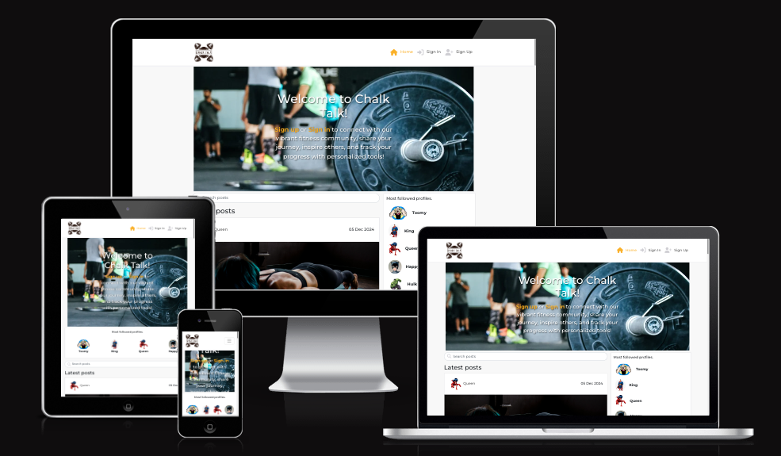

[Chalk Talk Live website](https://chalk-talk-react-444e4f93c93c.herokuapp.com/)

# Table of Contents
-   [UX - User Experience](#ux--user-experience)
    -   [Key features](#key-features)
    -   [User Goals](#user-goals)
    -   [Planning](#planning)
    -   [User journey](#user-journey)
- [Design](#design)
- [Project Planning](#project-planning)
    -   [Strategy plane](#strategy-plane)
    -   [Agile Methodologies](#agile-methodologies)
        -   [Sprint Planning](#sprint-planning)
        -   [MoSCoW Prioritization](#moscow-prioritization)
        -   [User Stories](#user-stories)
    -   [Scope plane](#scope-plane)
    -   [Structural plane](#structural-plane)
    -   [Skeleton & Surface Planes](#skeleton--surface-planes)
        -   [Wireframes](#wireframes)
        -   [Database schema - ERD](#database-schema---erd)
        -   [Security](#security)
-   [Features](#features)
    -   [Existing Features](#existing-features)
        -   [Features Functionality](#features-functionality)
        -   [CRUD Functionality](#crud-functionality)
        -   [All Existing Features with Screenshots](#all-existing-features-with-screenshots)
            -   [Home Page](#home-page)
            -   [User Registration, Login](#user-registration-login)
            -   [User Profile](#user-profile)
            -   [Search Functionality](#search-functionality)
            -   [Responsive Navigation Bar](#responsive-navigation-bar)
            -   [Add Posts](#add-posts)
            -   [Comments](#comments)
            -   [My Posts](#my-posts)
            -   [My Feed](#my-feed)
            -   [Add Personal records](#add-personal-records)
            -   [My Personal records](#my-personal-records)
            -   [Percentage count of 1 rep max](#percentage-count-of-1-rep-max)            
            -   [Error Handling](#error-handling)
    -   [Future Features](#future-features)
-   [Reusable React Components](#reusable-react-components)
-   [Technology Used](#technology-used)
    -   [Frontend](#frontend)
    -   [Backend](#backend)
    -   [Deployment and Version Control](#deployment-and-version-control)
    -   [Development Tools](#development-tools)
    -   [Security](#security-1)
    -   [Others](#others)
-   [Testing & Validation](#testing--validation)
-   [Deployment](#deployment)
    -   [Step-by-Step Guide](#step-by-step-guide)
    -   [Additional Configurations](#additional-configurations)
-   [Cloning nad Forking](#cloning-and-forking)
    -   [Cloning the Repository](#cloning-the-repository)
    -   [Forking the Repository](#forking-the-repository)
-   [Credits](#credits)
    -   [Code](#code)
    -   [Media](#media)
-   [Acknowledgements](#acknowledgements)
    -   [Inspiration](#inspiration)
    -   [Project Giudance](#project-guidance)
    -   [ReadMe Structure](#readme-structure)
    -   [Personal Thanks](#personal-thanks)

# UX - User Experience
## Key features
Chalk Talk offers a range of features to help you stay motivated and connected on your fitness journey, including:
-   **Navigation bar:** Navigate easily with our comprehensive navigation bar, which includes links to essential pages, depending on your logged in status.
-   **User Authentication:** Sign up, log in, and manage your profile with ease.
-   **Profile Management:** Customize your profile, including personal information and profile picture.
-   **Community Interaction:** Share updates through - post content, like, and comment on posts within the community.
-   **Store and share personal records:** Log your own personal records, show them off to peers and use a percentage calculator to easily get the perscribed weight in a workout from your personal records log.
-   **Responsive Design:** Access the platform from any device, whether it's a desktop, tablet, or mobile phone.
-   **User Contributions:** Registered users can contribute their own posts, share their fitness journeys and personal records.
## User goals
-   **New Users:** Easily create an account, set up a profile, and start engaging with the community.
-   **Returning Users:** Quickly log in, track their personal records and interact with posts.
-   **Community Members:** Comment on posts, like favorite content, and follow other users.
-   **Fitness Enthusiasts:** Log personal records and make use of the calulator for workout percentages. Share content and personal records to give and get inspiration to daily workouts.
-   **Contributors:** Create and share new posts related to fitness and wellness.
## Planning
Chalk Talk is designed with a user-centric approach, ensuring that the platform is intuitive and easy to navigate. The key aspects of the design include:

-   **Responsive Design:** The platform is fully responsive, providing a seamless experience on desktops, tablets, and mobile devices.
-   **Clean and Modern UI:** A clean, modern interface that focuses on usability and aesthetic appeal.
-   **Easy Navigation:** Intuitive navigation menus and a well-structured layout to help users find the features they need quickly.

## User journey
-   **Onboarding:** New users are guided through a simple sign-in and sign-up process.
-   **Exploration:** Users can explore the platform, reading posts, connecting with other users, and staying updated with their peers and their personal records achievements.
-   **Engagement:** Users actively participate by logging their personal records and interacting with the community through posts, comments and likes.
-   **Tracking Progress:** Users can view their progress over time, track their personal records, and see improvements in their daily routines and fitness levels.
-   **Contribution:** Users can share their knowledge by creating posts and helping to grow the community.

By focusing on these key aspects of the user experience, Chalk Talk aims to provide a platform that is not only functional but also enjoyable to use, encouraging users to stay active, engaged, and motivated in their fitness journey.

# Design
## Logo and Branding 
The logo of Chalk Talk, containing barbells and weight plates and chalky stamp with the Chalk Talk text provides a strong visual identity for the brand.

## Colors
-   **Orange:** Represents energy and enthusiasm. Used for highlights. #faad1ff3 and goldenrod
-   **Green:** Represents health and vitality. Used for buttons. #308017
-   **White:** Used for backgrounds and text to provide contrast and readability. #FFFFFF
-   **Black:** Used for text to provide contrast. #333
-   **Red:** Used for heart icons to like and unlike posts. #f85032
-   **Gray:** Different gray scales used throughout the application to provide contrast.

## Fonts
Chalk Talk utilizes two primary fonts from Google Fonts: **Montserrat** and **Permanent Marker**. Montserrat was chosen for it's readability and modern appearance and Permanent Marker to give a handwritten feeling on chalk board. Both align with the application's theme of fitness, playfulness and well-being.

# Project Planning
## Strategy plane
**Overview:**
Chalk Talk is a versatile platform created for fitness enthusiasts to document their daily workouts and personal records, discuss fitness and health, and share thoughts and inspiration around training. Acting as a communal hub, it allows users to interact, inspire each other, and stay dedicated to their fitness objectives. Utilizing the latest web technologies, Chalk Talk provides a smooth user experience on all devices.

**Goals:**
-   Offer a comprehensive resource for fitness enthusiasts to share experiences, wins and thoughts, and discuss fitness.
-   Cultivate a community where users can connect, motivate, and support one another.
-   Ensure a user-friendly interface that is accessible and easy to navigate.

**Audience:**
-   Users interested in sharing their fitness journeys and engaging with a supportive community.
-   Athletes seeking a tool to document personal records and make use of a percentage calculator in their daily workout routine.

**User Needs:**
-   Ability to interact with other community members through comments, likes, and follows.
-   Ability to express the level of CrossFit experience and write a bio to let other users know more about the athlete.
-   Ability to document personal records to keep track of them and to utilize that data for calculation of weight in daily workouts.
-   Ability to view other users personal records for inspiration.

**Features:**
-   Post upload functionality to share content related to fitness.
-   Community interaction through comments, likes, and follows.
-   User profiles for personalized experiences.
-   Personal Record documentation and percentage calculator.

## Agile Methodologies
This project was developed using Agile methodology which allowed me to iteratively and incrementally build my app, with flexibility to make changes to my design throughout the entire development process.

GitHub Issues and Projects were used to manage the development process. The board view of the Project feature was used to display and manage my progress in the form of a 'kanban board'. The user stories were added to the 'Todo' column to be prioritised for development, moved to the 'In Progress' column to indicate development of the feature had begun and finally moved to the 'Done' column when the feature had been implemented and the acceptance criteria had been met.

### Sprint Planning
The project was divied into six sprints using Milestones in GitHub Projects. This rapid sprint approach allowed me to break down the project into manageable chunks and maintain focus on delivering key features and functionality on time.

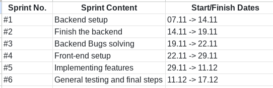

[Chalk Talk Milestones Link](https://github.com/SophieTiger/chalk-talk-api/milestones)

### MoSCoW Prioritization
-   **Must Haves:** the 'required', critical components of the project. Completing my 'Must Haves' helped me to reach the MVP (Minimum Viable Product) for this project.
-   **Should Haves:** the components that are valuable to the project but not absolutely 'vital'. The 'Must Haves' must receive priority over the 'Should Haves'.
-   **Could Haves:** these are the features that are a 'bonus' to the project, it would be nice to have them in this phase, but only if the most important issues have been completed first and time allows.
-   **Won't Haves:** the features or components that either no longer fit the project's brief, get taken out of the scope or are of very low priority for this release.

### User Stories
To start with I created a sheet with all the user stories that I wanted to cover, before moving them to issues in the Github Project Kanban board. This is a little bit of that sheet:
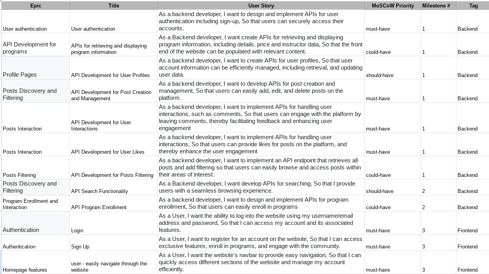

Here is a link to the [Kanban Board](https://github.com/users/SophieTiger/projects/5) where all user stories can be viewed.

**User stories that was taken out of scope**
During development the features for adding, viewing and booking programs was taken out of scope and prioritization was changed to "Won't have". This was due to lack of time and those features has been added to potential future features for the project. Issues were closed as "not planned".

## Scope plane
The scope plane defines the specific features and functionalities that Chalk Talk will offer. It outlines what the application will do to meet user needs and the business goals.

**Features and Functionalities**
-   **User Management**
    -   User Registration: Allow users to create an account to take part in the community and track their personal records.
    -   Secure User Login: Enable users to log in securely to access personal data and interact with the site.
    -   Profile Customization: Let users customize their profiles to express themselves and manage their profile.
    -   Editable User Profiles: Provide users with the ability to edit their profiles to update their information.

-   **Social Interaction and Community**
    -   Posting Content: Allow users to share their fitness progress with the community.
    -   Commenting on Posts: Enable users to comment on posts to engage with the community.
    -   Liking Posts: Let users like posts to show appreciation for the content.
    -   Following Other Users: Allow users to follow others to stay updated with their activities.

-   **Personal Records and the display**
    -   Create Personal Records: Users can create personal records to keep track of them.
    -   Edit/Delete Personal Records: Uusers can edit or delete Personal Records to manage them effectively.
    -   View Personal Records: Users can view their own and other users Personal Records.
    -   **Filtering Personal Records**: Users can filter and search Personal Records by exercise if there are many in the list.
    -   Count percentages based on Personal Records: Users can use the functionality in the PR's page by clicking the percentage sign on each personal record to get percentages on that specific exercise based on what they have logged.

-   **Platform Navigation and User Experience**
    -   Pre-login Homepage Viewing: Visitors can view the homepage to understand the platform before logging in.
    -   Dynamic Navigation Bar: The navigation bar updates dynamically based on the user's login status.
    -   Seamless Routing: Ensure smooth navigation throughout the app.
    -   Enhanced Navigation & Authentication: Provide a streamlined user experience for accessing and using the platform.

-   **Testing and Deployment**
    -   Thorough Testing: Conduct comprehensive testing to ensure the application's reliability.
    -   Documentation: Provide clear documentation to enhance understanding for developers and users.
    -   Application Deployment: Deploy the application to a live environment, ensuring stability and correctness.

## Structural plane
The structural plane outlines the organization and hierarchy of information within Chalk Talk. It defines how the features and functionalities are structured and how users will interact with them.

**Information Architecture**

-   **Home Page:**
    -   Overview of the platform
    -   Prompted access to sign in and sign up
    -   Preview of featured posts and popular profiles

-   **User Authentication:**
    -   Login Page: Secure login form
    -   Registration Page: User registration form

-   **User Profile:**
    -   Profile customization options
    -   View and edit profile information
    -   Display of user's posts, followers and following
    -   Display of user's personal records

-   **Social Interaction:**
    -   Add Post Page: Create or edit a post
    -   Home Page: View posts from all users in the community
    -   Friends Feed: View posts from followed users
    -   Post Detail Page: View detailed post content, comment, and likes

-   **Personal Records:**
    -   Personal Records Listing Page: Browse, Create and filter personal records
    -   Personal Records Create: Create new personal record by filling in the form on the PR's page
    -   Personal Records individual display: Browse specific PR and click percentage button to make use of the percentage calculator for that specific personal record
    -   Personal Records Edit/Delete: Edit or delete personal records by clicking the dropdown menu on the specific Personal Record to manage it

**Navigation Structure**

-   **Top Navigation bar**
    -   Home
    -   Add Post (dynamic, shows when logged in)
    -   Friends Feed (dynamic, shows when logged in)
    -   PR's (dynamic, shows when logged in)
    -   Profile (dynamic, shows when logged in)
    -   Sign out (dynamic, shows when logged in)
    -   Sign In (dynamic, shows when NOT logged in)
    -   Sign Up (dynamic, shows when NOT logged in)

This structure ensures that users can easily navigate through the platform, find relevant information, and interact with the community effectively. The combination of the scope and structural planes provides a comprehensive blueprint for developing and organizing Chalk Talk.

## Skeleton & Surface Planes
### Wireframes
I've used [Balsamiq](https://balsamiq.cloud/) to design the site wireframes.

**Home Page**

Click here to View Home Page wireframes

Click here to View Home Page after Login wireframes

**Add Post**

Click here to View Add Post wireframes

**Friends Feed**

Click here to View Friends Feed wireframes

**PR's**

Click here to View PR's wireframes

**Profile page**

Click here to View Profile page wireframes

**Sign Up**

Click here to View Sign Up wireframes

**Sign In**

Click here to View Sign In wireframes

### Database Schema - ERD
I've used [Lucidchart](https://www.lucidchart.com/pages/) to design  the ERD

The Chalk Talk application is structured on a robust database schema designed to facilitate the efficient organization and retrieval of data. Below is an overview of the database schema and the relationships between the different entities.
The Database Models presented in Blue color are the ones that have been implemented in the project. The light orange ones, Program and Booking, have not been implemented but was in the scope from the beginning and then taken out due to lack of time. They are still in the diagram though because I think of them as future features to implement and this is the relationships and content they would have.

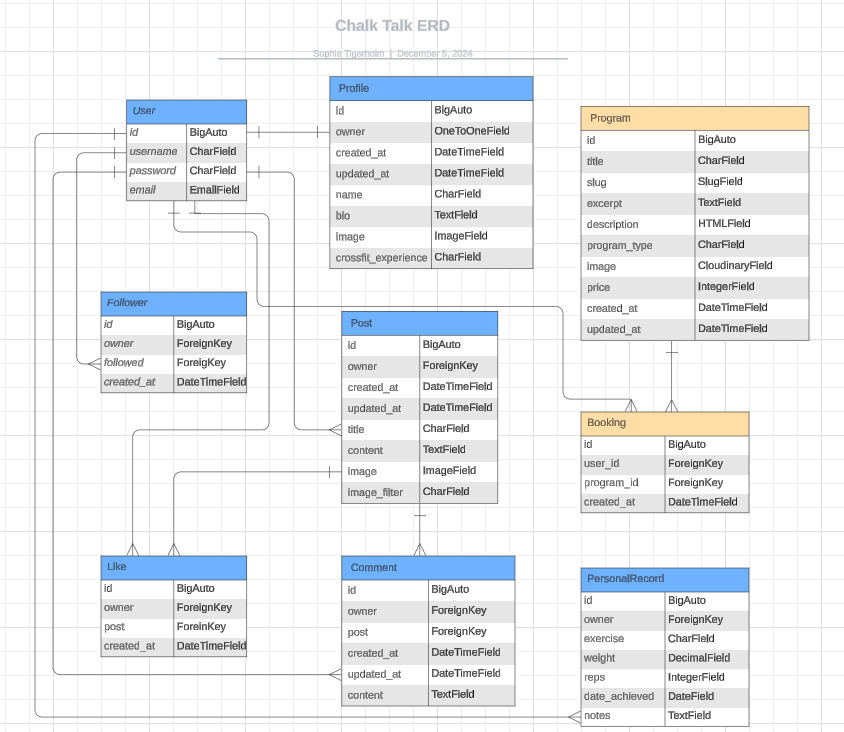

#### Tables Overview

-   **User:** Stores information about the users of the platform, including username, email, and password.

-   **Profile:** Contains extended user information such as name, created date, and personal details such as bio, image and crossfit experience. This table extends the User table by associating profiles with user accounts.

-   **Post:** Stores posts created by users, including the post content, associated media, creation date, and the user who created the post.

-   **Comment:** Enables community interaction by storing comments made by users on posts. Each comment is linked to a specific post and user.

-   **Like:** Records likes given by users to posts, tracking which user liked which post.

-   **Follower:** Tracks the relationships between users, allowing one user to follow another.

-   **Personal Record**: Central to the application, the Personal Record table holds data about Personal Records achieved and are added by the user. Personal Records include exercise, weight, reps, date achieved and notes.

#### Relationships

-   A **one-to-one** relationship exists between User and Profile, where one user can have only one Profile 
-   A **one-to-many** relationship exists between User and PersonalRecord, where one user can have many personal ecords.
-   A **one-to-many** relationship exists between User and Post, where one user can create many posts.
-   A **one-to-many** relationship exists between Post and Comment, where one post can have many comments.
-   A **one-to-many** relationship exists between User and Comment, where one user can create many comments.
-   A **one-to-many** relationship exists between Post and Like, where one post can have many likes.
-   A **one-to-many** relationship exists between User and Like, where one user can like many posts.
-   A **one-to-many** relationship exists between User and Follower, where one user can follow many users.

### Security
Security is a critical aspect, especially for a platform like Chalk Talk that handles user-generated content and personal data.

#### Data encryption
-   All sensitive data, including user passwords and personal information, are encrypted using robust encryption methods to protect against unauthorized access and breaches.

#### Django AllAuth
-   Django AllAuth is an installable framework that handles the user registration and authentication process. Authentication is essential to determine when a user is registered or unregistered and to control what content is accessible on Chalk Talk.

#### API Security
-   The backend uses Django REST framework (DRF) for building the API, with token-based authentication to ensure secure access to the API endpoints.
-   Only authenticated users can perform actions like creating posts and personal records, commenting, liking, following and updating profiles.

# Features
## Existing Features
### Features Functionality
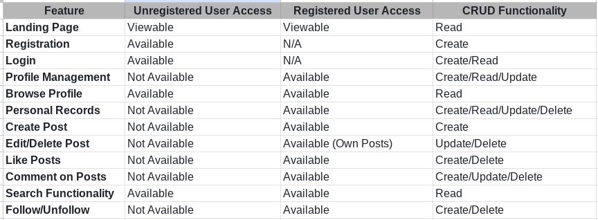
### CRUD Functionality
The table below describes the CRUD operations that can be performed on Chalk Talk's main features by a registered, logged-in user.
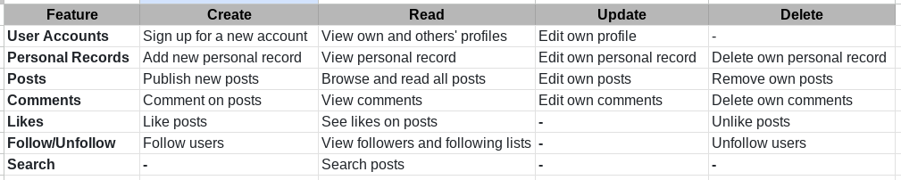

### All Existing Features with Screenshots
#### Home Page
-   The first contact with Chalk Talk is the Home page where the user immediately gets am understading of the purpose of the site. The Hero image with a gym setting, people talking, and a text clearly explaining why users should sign up or sign in is aiming to attract new users to the community.
**Home page for non logged in users**
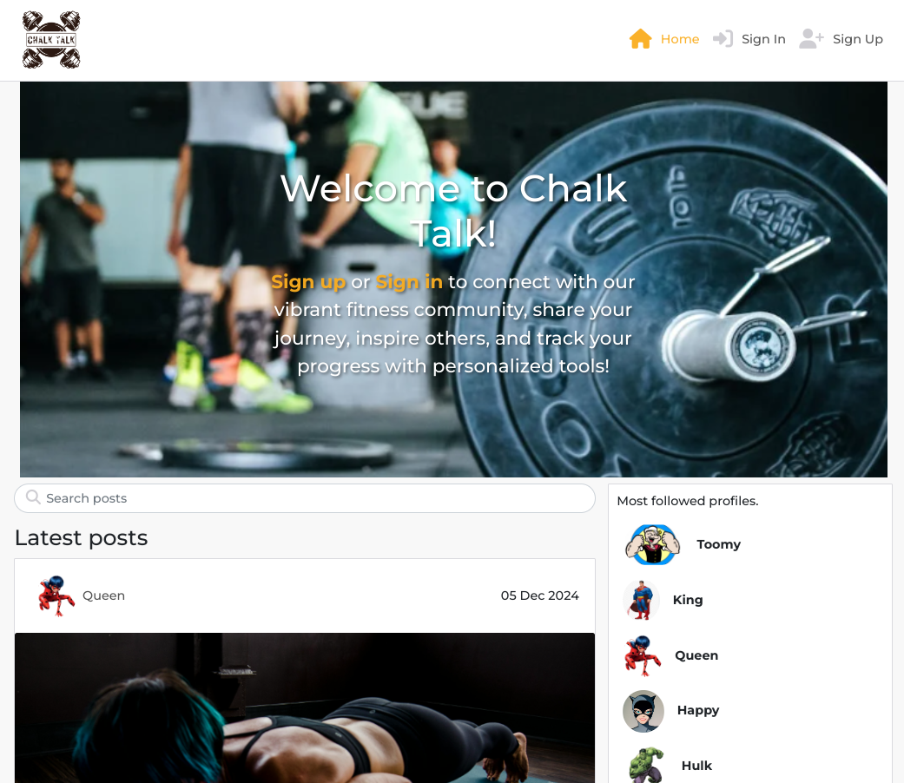

**Home page for logged in users**
-   When the user logs in, the navbar expands to show functionality aimed for authenticated users.
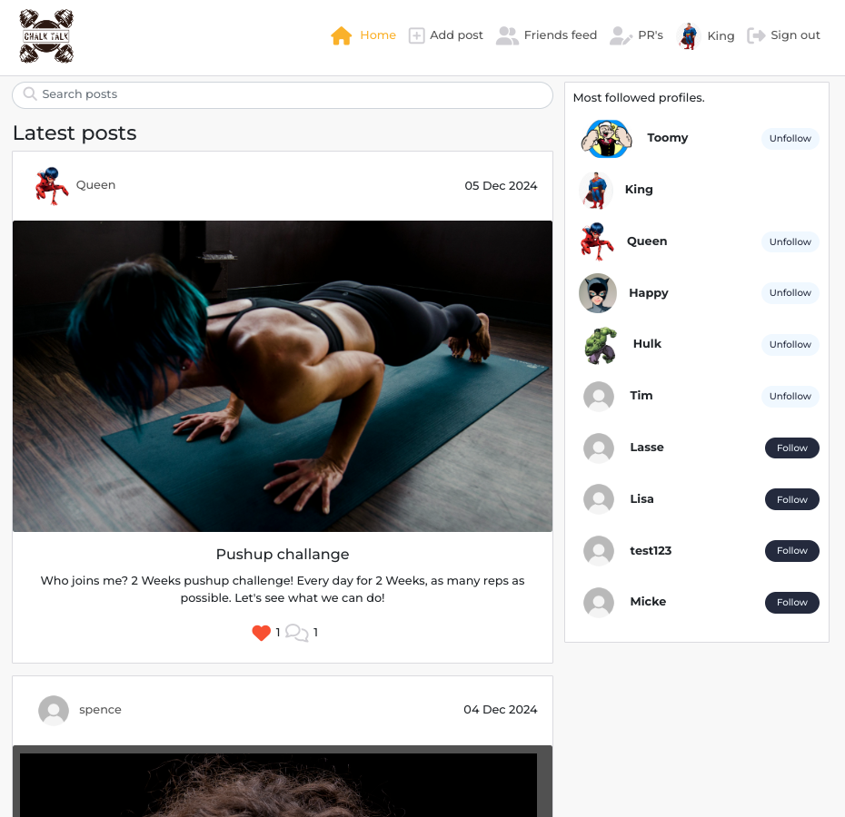

#### Search Functionality
-   The searchbar allows users to type in search keywords for post titles and shows results accordingly.
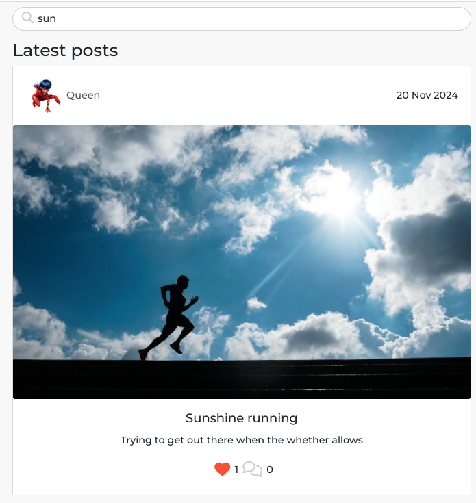

-   If no results were found, the user is asked to try another search keyword.
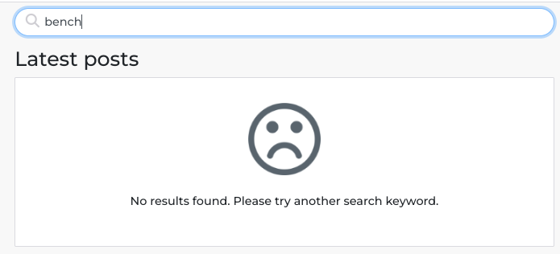

#### Sign Up page
-   New users can sign up by providing their username, email, and password. 
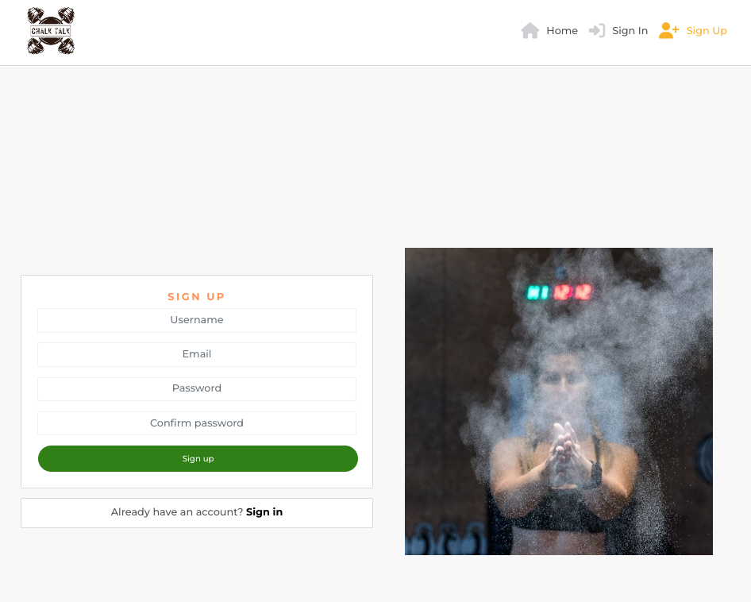

#### Sign In page
-  Existing users can log in using their credentials to access personalized features.
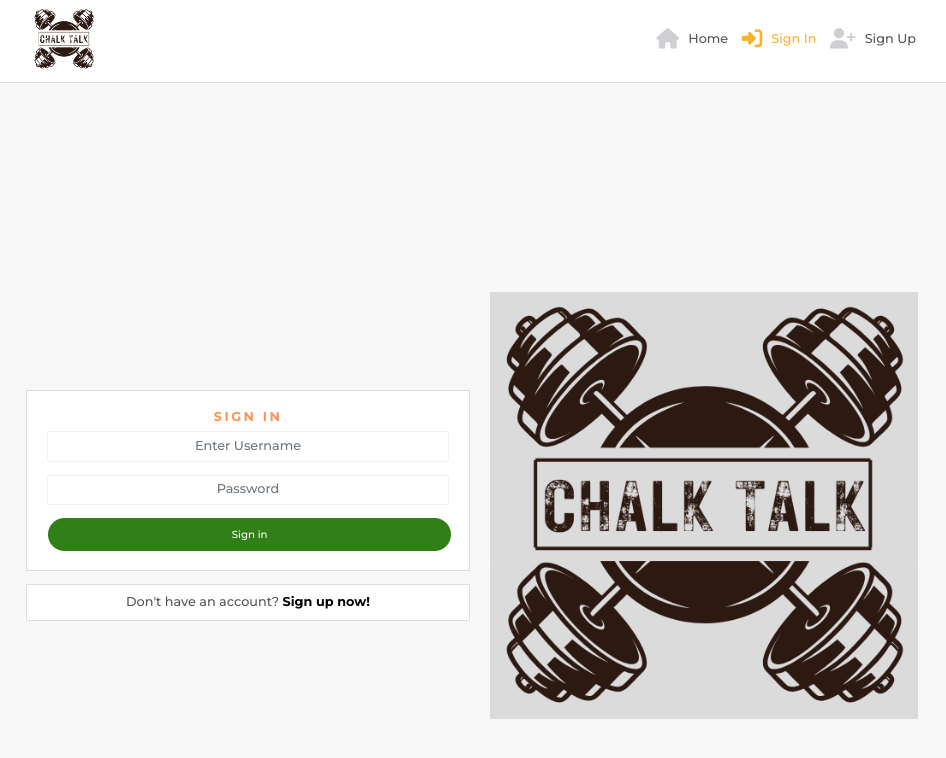

#### Responsive Navigation Bar
The navigation bar provides easy access to all sections of the site, adjusts for different screen sizes, and includes user authentication options.

-   Before user login:

-   After user login:

-   On smaller screens the navbar is shown as a burger icon:

-   When clicking the burger icon, it expands:
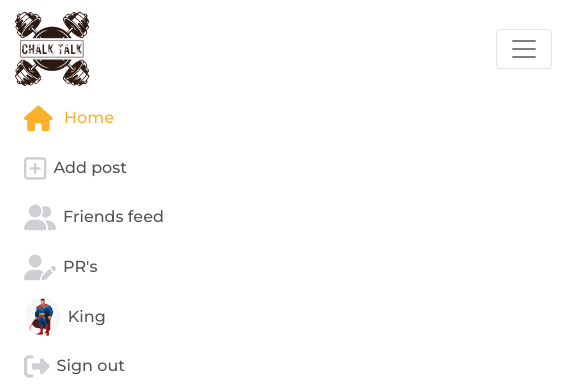

#### Add Posts
-   Users can create posts by providing a title, content, tag and image.
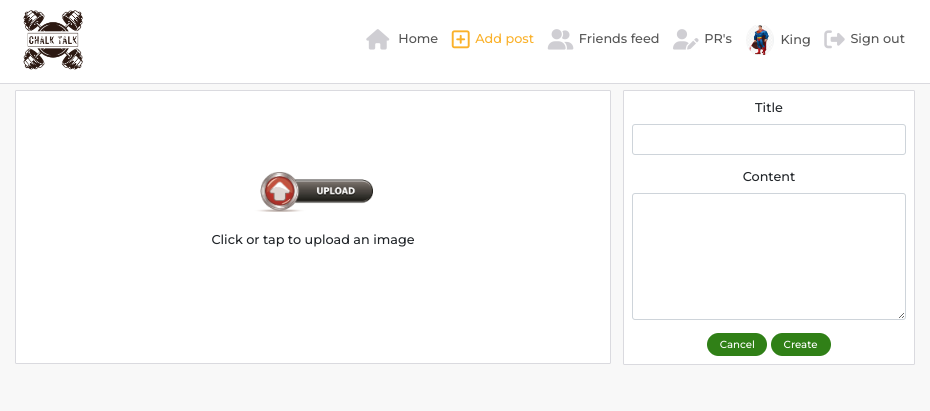

#### Comments
-   Users can leave comments on posts, engage in discussions, and provide feedback. They can also edit and delete their own comments.
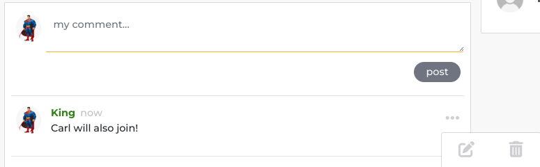

#### Friends Feed
-   On the friends feed page, only the posts created by followed users are shown.
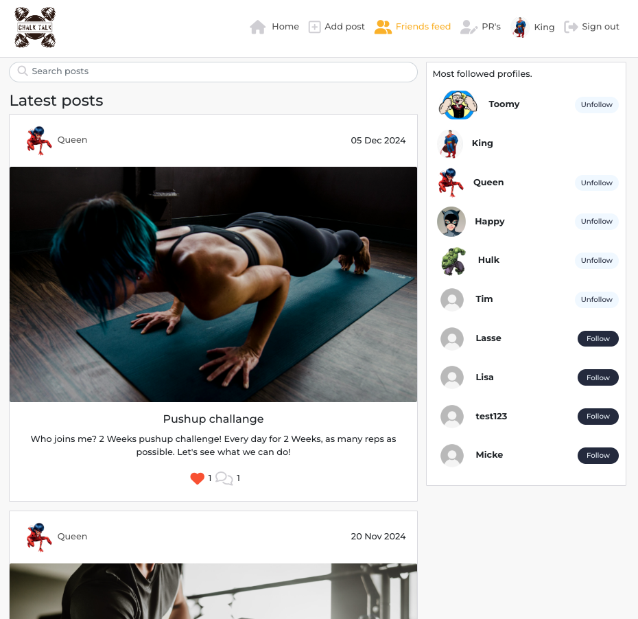

#### Personal records page
-   On the PR's page the user is asked to add a Personal Record if there are none. That can be done by using the form, adding exercise, weight, number of reps, date achieved and notes.
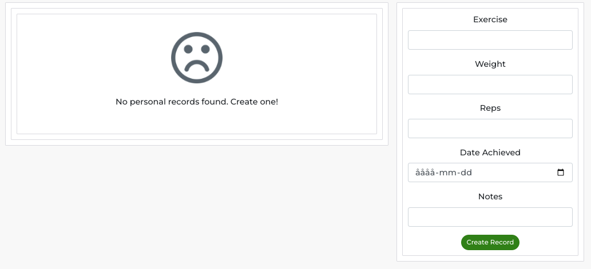

-   When a personal record is added it shows up in the personal records list.
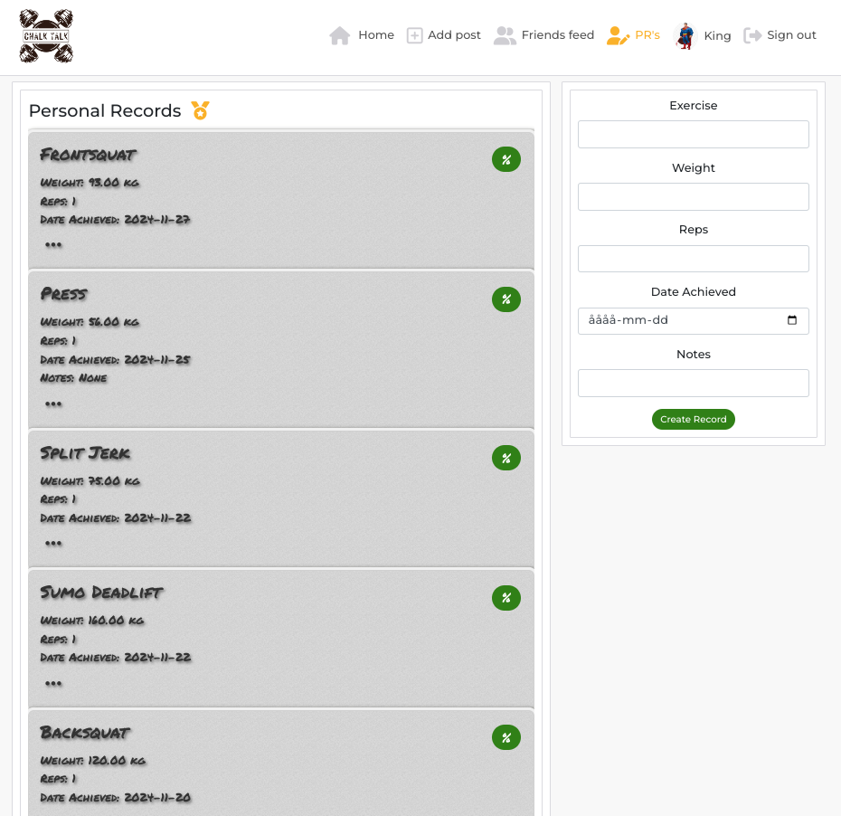

-   When the button with the percentage sign is clicked on a personal record, a list of 1 rep max percentages is shown in a list:

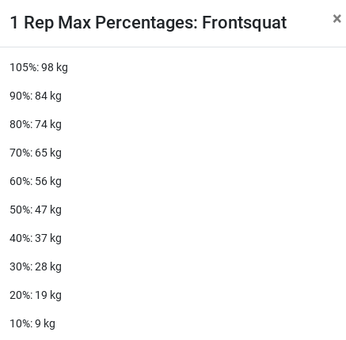

-   Personal records can be edited and deleted by clicking the three dots on the specific personal record:
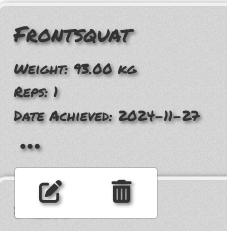

#### Profile page
-   Upon logging in, users can view and edit their profiles, username and password by clicking the three dots.
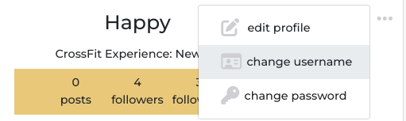

-   When user enters edit mode on the profile for the first time the CrossFit Experience is set to "Newbie", that can be changed in the dropdown menu, as well as entering a personal bio, name and adding a profile picture.
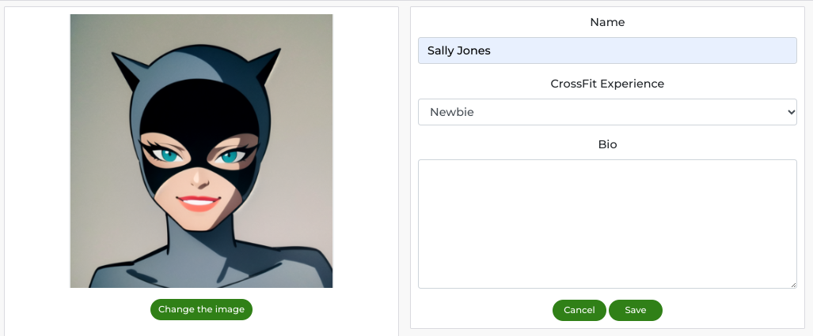
 
-   Users can view other users profile and personal records on the profile page, by clicking on another users avatar. On the profile page there is a list of maximum the latest 10 personal records shown for that user. 
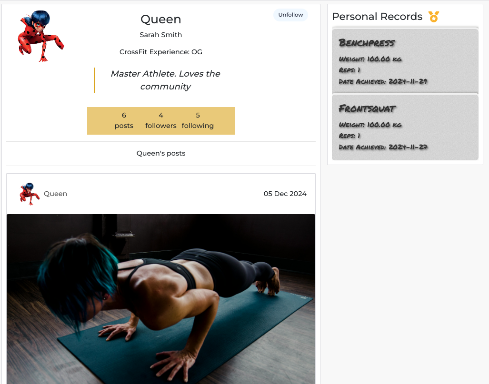

-   If a user has no posts or PR's that is displayed on the profile page.
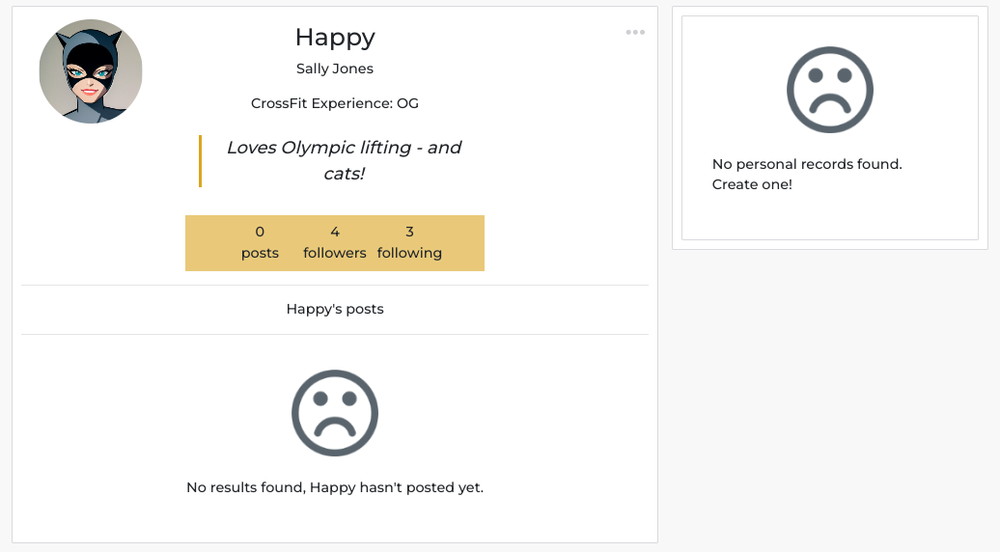

#### Error Handling
-   Custom error pages are designed to inform users of various errors such as Page not found along with a user-friendly message and a button with a link back to the homepage.
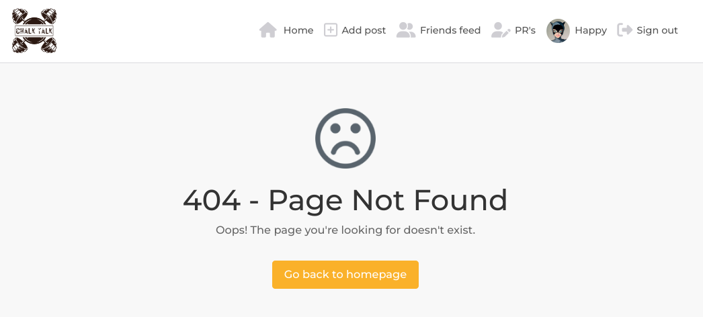

## Future Features
-   Add programs for Personal training, Bootcamps and Nutrition Coaching to the app according to business needs.
-   Add booking functionality for programs.
-   Add Notifications to let users know when interaction was made to their content, such as likes and comments.
-   Add search functionality to personal records page to allow users with many PR's to search their records.
-   Add the option for users to delete their own profile.

# Reusable React Components
In the Chalk Talk application, several reusable components were developed or imported to maintain consistency, improve efficiency, and ensure scalability. Below is an overview of some key reusable components used throughout the application:

## Custom components
**NavBar**
-   Purpose: Main navigation component
-   Usage: `<NavBar />`
-   Examples: Main navigation bar, mobile navigation menu.

**Asset**
-   Purpose: Displays loading spinner or image
-   Usage: `<Asset spinner /> or <Asset src={NoResults} />`
-   Examples: Shows when content is loading and if no results found, an image is shown.

**MoreDropdown**
-   Purpose: Dropdown menu for editing and deleting
-   Usage: `<MoreDropdown handleEdit={editFunction} handleDelete={deleteFunction} />`
-   Examples: Shown as three dots menu on posts, profile and personal records.

**Avatar**
-   Purpose: Displays user avatar
-   Usage: `<Avatar src={image} height={imageSize} />`
-   Examples: Shown in the profile as a placeholder image if no profile picture.

**NotFound**
-   Purpose: 404 error page
-   Usage: `<NotFound />`
-   Examples: Custom error page for 404 error message

## Imported components from react-bootstrap
**Button**
-   Purpose: Buttons for user actions
-   Usage: The Button component is used across various forms and modal dialogs to handle user actions such as submitting forms, confirming actions, and navigating through the application. 
-   Examples: Login form submission, confirmation modals.

**Modal**
-   Purpose: The Modal component is used for displaying dialogs and overlay content.
-   Usage: It provides a consistent look and feel for all modals, ensuring a uniform user experience.
-   Examples: Confirmation dialogs, percentage calculation.

**Card**
-   Purpose: The Card component is utilized to display content in a structured and visually appealing way.
-   Usage: It is used for showing posts.

**Form**
-   Purpose: The Form component is a generic wrapper that handles form submission, validation, and error handling.
-   Usage: It simplifies the creation of new forms and ensures a consistent user experience.
-   Examples: User registration, login, post creation, adding personal records.

# Technology Used
## Frontend
-   [HTML5](https://developer.mozilla.org/en-US/docs/Web/Guide/HTML/HTML5): Structure of the web pages.
-   [CSS3](https://developer.mozilla.org/en-US/docs/Web/CSS): Styling of the web content.
-   [JavaScript](https://developer.mozilla.org/en-US/docs/Web/JavaScript): Enhancements of interactivity and web behaviors.
-   [React](https://reactjs.org/): JavaScript library for building user interfaces.
-   [React Bootstrap](https://react-bootstrap.github.io/): The most popular front-end framework rebuilt for React. Provides a variety of reusable components for responsive web design.
-   [React Router](https://reactrouter.com/): A collection of navigational components that compose declaratively with your application.
-   [Axios](https://axios-http.com/): A promise-based HTTP client for making requests to the backend API.

## Backend
-   [Django](https://www.djangoproject.com/): A high-level Python web framework.
-   [Django REST Framework (DRF)](https://www.django-rest-framework.org/): Toolkit for building Web APIs with Django.
-   [Python](https://www.python.org/): Backend programming language.
-   [SQLite](https://www.sqlite.org/index.html) (Development) database system
-   [PostgreSQL](https://www.postgresql.org/) (Production) database system

## Deployment and Version Control
-   [Git](https://git-scm.com/): Used for version control.
-   [GitHub](https://github.com/): Hosts the repository and facilitates version control and collaboration.
-   [Heroku](https://www.heroku.com/): Platform as a service (PaaS) for deploying applications.
-   [Cloudinary](https://cloudinary.com/): Media management and optimization.

## Development Tools
-   [GitPod](https://www.gitpod.io/): Preferred IDE for writing and editing code.
-   [Django AllAuth](https://django-allauth.readthedocs.io/en/latest/): Integrated set of Django applications addressing authentication, registration and account management.
-   [Balsamiq](https://balsamiq.com/): Used for creating wireframes and mockups.
-   [Lucidchart](https://www.lucidchart.com/pages/): Used to design site's ERD.

## Security
-   [Django AllAuth](https://django-allauth.readthedocs.io/en/latest/): For user registration and account management.
-   **Data Encryption**: All sensitive data, including user passwords and personal information, are encrypted using robust encryption methods.

## Others
-   [React Infinite Scroll Component](https://www.npmjs.com/package/react-infinite-scroll-component): A simple React component to handle infinite scroll for large datasets.
-   **Custom hooks**:
    -   The **useRedirect** hook manages user authentication redirects. It attempts to refresh the authentication token and redirects users based on their login status, either to the home page if logged in or out as specified.
    -   The **useClickOutsideToggle** hook handles the toggling of a component (like a dropdown) and closes it when clicking outside. It returns an expanded state, a function to set this state, and a ref to attach to the component being controlled.
-   [Font Awesome](https://fontawesome.com/): A popular icon set and toolkit used to add icons the project.
-   [Favicon.io](https://favicon.io/): To generate favicon icons for the website.
-   [Tiny Png](https://tinypng.com/): To compress the images.
-   [Birme.net](https://www.birme.net/?target_width=100&auto_height=true): To change size of images.

# Testing & Validation
For all testing and validation, please refer to the [TESTING.md](/TESTING.md) file.

# Deployment
Deploying the Chalk Talk frontend involves using Heroku, a popular cloud platform that enables easy application deployment. Below are the steps for deploying the React frontend of the Chalk Talk application without using the Heroku CLI.

Prerequisites:
-   A GitHub account
-   A Heroku account
-   The React application(own version) repository pushed to GitHub or [Chalk Talk React Backend Github Repo](https://github.com/SophieTiger/chalk-talk-api)

**You will need to ensure the value of axios.defaults.baseURL in src/api/axiosDefaults.js is set to the base URL for your API. Pull to your local development environment and push back to GitHub if necessary; otherwise, leave as is to use the original**

## Step-by-Step Guide:
1.  **Create a Production Build:**

Before deploying, you need to create a production build of your React application. Run the following command in your local development environment:

`npm run build`
This will create a build directory with a production build of your app.

2.  **Create a New Heroku Application:**

Log in to your Heroku account and navigate to the dashboard. Click on "New" and select "Create new app."
Enter a unique name for your application and select your region.

3.  **Connect GitHub Repository to Heroku:**

In your Heroku dashboard, navigate to the "Deploy" tab of your newly created application. Under the "Deployment method" section, select "GitHub."
Click on "Connect to GitHub" and authorize Heroku to access your GitHub account. Search for your repository name and connect it.

4.  **Enable Automatic Deploys:**

After connecting your repository, enable automatic deploys by clicking on the "Enable Automatic Deploys" button. This will ensure that every push to your GitHub repository triggers a new deployment on Heroku.

5.  **Manual Deployment:**

To manually deploy your app, scroll down to the "Manual deploy" section, select the branch you want to deploy (typically main or master), and click "Deploy Branch."

6.  **Configure Buildpacks:**

Heroku automatically detects the buildpack for create-react-app, but if needed, you can add the buildpack manually. Navigate to the "Settings" tab, click "Add buildpack," and select "nodejs."

7.  **Configure Environment Variables:**

If your application uses environment variables, configure them in the Heroku dashboard under the "Settings" tab. Click on "Reveal Config Vars" and add your key-value pairs.

8.  **Monitor Deployment:**

Once the deployment process begins, you can monitor its progress in the "Activity" tab. Heroku will show the build logs and indicate whether the deployment was successful.

9.  **Access Your Application:**

Once the deployment is successful, Heroku will provide a URL to access your application. Click on "Open App" in the Heroku dashboard to view your live site.

## Additional Configurations
**Static Files Serving:** Ensure your React app is configured to serve static files correctly by setting the appropriate paths in your build configuration.

**Error Handling:** Make sure your app has proper error handling for production, including custom error pages and logging mechanisms.

**Security:** Use environment variables for sensitive information and ensure HTTPS is enforced on your Heroku app.

# Cloning and Forking
## Cloning the Repository
**Local Setup:**

1.  **Clone the repository:** [Chalk Talk GitHub repository](https://github.com/SophieTiger/chalk-talk/tree/main).
`git clone https://github.com/SophieTiger/chalk-talk.git`

2.  **Navigate into the project directory:**
`cd chalk-talk`

3.  **Install dependencies:**
`npm install`

4.  **Start the development server:**
`npm start`

## Forking the Repository
**For Contributions:**

1.  **Fork the repository:** [Chalk Talk GitHub repository](https://github.com/SophieTiger/chalk-talk/tree/main)

2.  **Clone your forked repository to your local machine:**
`git clone https://github.com/SophieTiger/chalk-talk.git`

3.  **Navigate into the project directory:**
`cd chalk-talk`

4.  **Install dependencies:**
`npm install`

5.  **Start the development server:**
`npm start`

6.  **Make changes** and **push** them back to your fork.

7.  **Create a pull request** from your fork back to the original repo.

By following these steps, you can either clone or fork the Chalk Talk repository and start contributing to the project or set it up for your own use.

# Credits
## Code
The following blogs/tutorials complemented my learning for this project:

-   [React Bootstrap](https://react-bootstrap-v4.netlify.app/getting-started/introduction/)
-   [React Router](https://reactrouter.com/en/main)

-   [Django REST Framework](https://www.django-rest-framework.org/)

-   **Code Institute Moments Walkthrough**
-   [Setting up basic Django Project with Cloudinary](https://docs.google.com/document/d/1LCLxWhmW_4VTE4GXsnHgmPUwSPKNT4KyMxSH8agbVqU/edit#heading=h.mpopj7v69qqn)

-   [Perplexity AI](https://www.perplexity.ai/) was used for solving issues like syntax errors and discussing structure of code.

## Media
-   The following sites were used to gather the photographic media used:
    -   [Pexels](https://www.pexels.com/)
    -   [Freepik](https://www.freepik.com/)
    -   Code Institute for the profile placeholder image

-   Chalk Talk Logo was created with [Canva](https://www.canva.com/create/logos/)

# Acknowledgements
The development of Chalk Talk has been a very hard but yet exciting journey, and I am grateful for the inspiration, guidance, and resources that have contributed to the project.

## Inspiration
The idea for Chalk Talk was inspired by [CHALK IT PRO](https://www.chalkitpro.com/) and their functionality to add personal scores and percentage count. Though I also wanted to have the a community-centric approach to allow gyms to add the app to their daily business for comprehensive fitness tracking and community engagement with a personal touch.

## Project Guidance
Moments DJANGO REST DRF API and Moments REACT Walkthrough Project I utilized the Moments Walkthrough Project as a foundational guide. This project provided valuable insights into structuring the application, implementing various features, and ensuring a seamless user experience. The Moments project had several ideas and functionalities similar to what I envisioned for Fit&Fine, which helped streamline my development process.

## ReadMe Structure
-   The structure and format of the ReadMe file was inspired by some fellow students projects: [AmirShkolnik](https://github.com/AmirShkolnik/DivingCenter), [raneem-yad](https://github.com/raneem-yad/wissen) and [SwathiKeshavamurthy](https://github.com/SwathiKeshavamurthy/FitandFine-P5) . The detailed and organized presentation of information in their ReadMe served as a great example for documenting Chalk Talk.
-   My own [PP4 Fitness Recipes](https://github.com/SophieTiger/fitness-recipes). This project provided valuable insights into structuring the application, implementing various features, and ensuring a seamless user experience.

## Personal Thanks
-   Thanks to my Code Institute mentor, Spencer Bariball, for supporting me in times of need and giving valuable guidance on this challenging journey!
-   Thanks to Kristyna, Cohort facilitator at Code Institute, for always being there to provide all the information needed and for keeping the positive energy up in times of dispare.
-   Thanks to my family for beliving in me when I lose hope.
