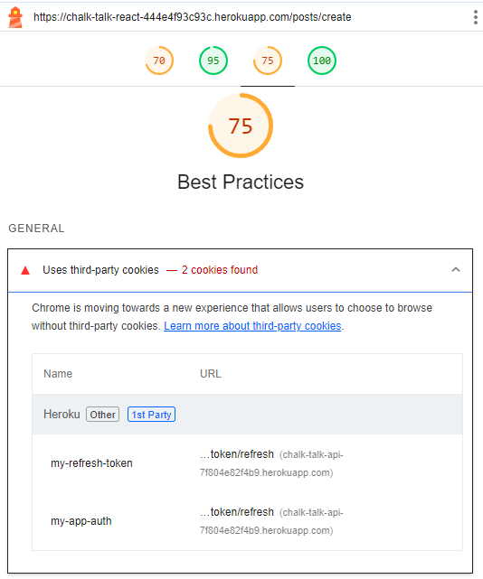
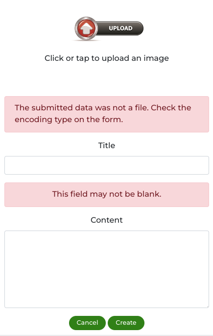
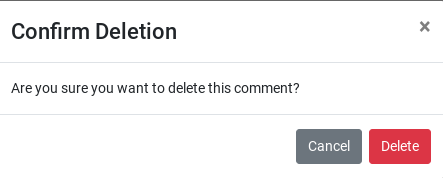

  

# Testing
This is the TESTING file for the [Chalk Talk](https://chalk-talk-react-444e4f93c93c.herokuapp.com/) website.

Return back to the [README.md](README.md) file.

## Table of Contents
- [Validation](#validation)
  - [HTML Validation](#html-validation)
  - [CSS Validation](#css-validation)
  - [JavaScript Validation](#javascript-validation)
- [Lighthouse](#lighthouse)
- [Wave Accessibility Evaluation](#wave-accessibility-evaluation)
- [Manual Testing](#manual-testing)
  - [User Input](#user-input)
  - [Form Validation](#form-validation)
  - [Browser Compatibility](#browser-compatibility)
  - [Responsiveness](#responsiveness)
- [User story testing](#user-story-testing)
- [Automated Testing](#automated-testing)
  - [Tools Used](#tools-used)
  - [Running Tests](#running-tests)

## Validation
To ensure the reliability, usability, and accessibility of Chalk Talk, various validation methodologies were implemented. These validations ensure that the application not only meets development standards but also provides a seamless user experience across different platforms and browsers. Below is an overview of the validation processes.

### HTML Validation
-   **Tool Used:** [HTML W3C Markup Validator](https://validator.w3.org/)
-   **Purpose:** Validates the HTML code of the application to ensure it is free from syntax errors and adheres to the standards set by the World Wide Web Consortium (W3C).
-   **Process:** All HTML pages of Chalk Talk are checked through the W3C validator to identify and fix any markup errors or warnings.

Validation results with no errors in index.html:

### CSS Validation
-   **Tool Used:** [W3C CSS Validation Service](https://jigsaw.w3.org/css-validator/)
-   **Purpose:** Ensures the CSS code is compliant with W3C standards, free from syntax errors, and follows best practices for styling.
-   **Process:** All CSS files are validated through the W3C CSS Validation Service to identify and rectify any issues.

**CSS Warnings:** This project includes custom styles that make use of vendor-specific extensions and pseudo-elements to ensure a consistent and polished user experience across various browsers and operating systems. During the linting process, certain warnings may appear, indicating the use of these vendor-specific extensions. These warnings are expected and can be safely ignored.

### JavaScript Validation
-   **Tool Used:** [ESLint](https://eslint.org/)
-   **Purpose:** To detect errors and potential problems in the JavaScript code, ensuring that all scripts run efficiently and are error-free. ESLint helps enforce consistent coding styles and best practices by identifying and fixing problematic patterns in JavaScript code.
-   **Process:** JavaScript code is run through ESLint to identify issues related to syntax, deprecated methods, and other inefficiencies.

**Steps to Run JavaScript Validation**
-   Install Dependencies: Ensure all required packages are installed by running: `npm install`
-   Run ESLint: To run ESLint across the whole project and identify any issues: `npx eslint .`

    -   After fixing the warnings and installing "@babel/plugin-proposal-private-property-in-object" as suggested all warnings are now cleared.
 
**Prettier for Code Formatting**

To maintain a consistent code style across the project I used the terminal to run Prettier on my entire project:
-   Install Prettier globally: `npm install -g prettier`
-   Run: `prettier --write "src/**/*.{js,jsx}"`

## Lighthouse
-   **Tool Used:** [Google Lighthouse](https://en.wikipedia.org/wiki/Google_Lighthouse) is an open-source, automated tool for improving the quality of web pages. It performs audits for performance, accessibility, progressive web apps, SEO, and more. You can run it against any web page, public or requiring authentication. 
-   **Purpose:** To assess the quality of web pages in terms of performance, accessibility, progressive web apps, SEO, and best practices.
-   **Process:** Chalk Talk is tested with Google Lighthouse, which provides a detailed report on various aspects of the site’s performance and offers recommendations for improvement.

**Home Page**

**Sign In Page**

**Sign Up Page**

**Add Post page**

**Post detail page**

**PR's Page**

**Profile Page**

I have compressed some images, but could not increase the performance scores.
Best practices show a score of 79 on some pages and it is due to refresh tokens.

Comparing the Lighthouse scores for Chalk Talk to other social media platforms, such as Instagram, I find the above scores ok.

## Wave Accessibility Evaluation
-   **Tool Used:** Wave Web Accessibility Evaluation Tool
-   **Purpose:** To ensure that the website is accessible to individuals with disabilities by identifying and suggesting fixes for web accessibility issues.
-   **Process:** The Wave tool evaluates each page of Chalk Talk to ensure it complies with accessibility standards like WCAG and Section 508.

## Manual Testing
Thorough testing was conducted on all pages, functionality and forms throughout Chalk Talk to ensure accurate user input validation and to provide necessary feedback.

### User Input
**Logged out users**

| Feature | Tested? | User Input Required | Expected result | Pass/Fail | Notes on Fix (If Any) |
|---------|---------|---------------------|------------------------|-----------|----------------------|
| Navigation Links | Yes | Click | Links redirect to corresponding pages. Hover effects indicate interactivity. | Pass | - |
| Home Page Welcome| Yes | Click | Welcome message is shown and prompts user to sign in or sign up | Pass | - |
| Home Page posts| Yes | Click | Clicking on posts takes users to detailed views. | Pass | - |
| Home Page profiles| Yes | Click | Clicking on a profile takes users to detailed views. | Pass | - |
| Sign Up Page | Yes | Username/Password/Confirm password | Validation prompts if incorrect input. Redirecting user to Sign In page | Pass | - |
| Sign In Page | Yes | Username and Password | Correct credentials required for login. Error message for failed login attempt. | Pass | - |
| Add Post Page | Yes | Text/Image Upload | Page is not shown when user is logged out. | Pass | - |
| Post Detail Interaction | Yes | Click on various elements | Detailed view of post with comments and like/follow count. | Pass | - |
| Personal Record Page | Yes | Text Input/Time Input | Page is not shown when user is logged out. | Pass | - |
| Friends Feed Page | Yes | Click | Page is not shown when user is logged out. | Pass | - |
| Profile Page | Yes | Text/Image Upload | Page is not shown when user is logged out. | Pass | - |
| Comments | Yes | Text Input | Users can view comments. Users cannot add comment. | Pass | - |
| Like Interaction | Yes | Click | Users can view likes. Users cannot add likes. | Pass | - |
| Follow Interaction | Yes | Click | Users cannot follow other users. | Pass | - |
| Search & Filter functionality | Yes | Text Input/Click | Relevant search results displayed. Message for no results found. | Pass | - |
| Mobile Navigation (Hamburger Menu) | Yes | Touch/Click | Responsive menu works on touch devices. Toggles correctly. | Pass | - |
| Form Error Handling | Yes | Invalid Inputs | Forms handle errors with descriptive messages guiding the user. | Pass | - |
| Responsive Design Elements | Yes | Resize/Change Orientation | All elements resize and adjust appropriately for different screen sizes. | Pass | - |
| Accessibility Features (e.g., ARIA) | Yes | Use of assistive technology | ARIA labels and roles are present, ensuring accessibility compliance. | Pass | - |

**Logged in users**
| Feature | Tested? | User Input Required | Expected result | Pass/Fail | Notes on Fix (If Any) |
|---------|---------|---------------------|------------------------|-----------|----------------------|
| Sign In Page | Yes | Username and Password | Correct credentials required for login. Error message for failed login attempt. Successful login redirects user to Home page. Profile username is diplayed in Navbar. | Pass | - |
| Navigation Links | Yes | Click | Links redirect to corresponding pages. Hover effects indicate interactivity. | Pass | - |
| Home Page Welcome | Yes | Click | Once user is logged in the welcome message is not shown. | Pass | - |
| Home Page posts| Yes | Click | Clicking on a post takes users to detailed views. | Pass | - |
| Home Page profiles| Yes | Click | Clicking on a profile takes users to detailed views. | Pass | - |
| Add Post and Submission | Yes | Text/Image Upload | Mandatory fields checked. Redirecting to post detail page. | Pass | - |
| Edit Post | Yes | Text/Image Upload | Form prepopulated with post data. Mandatory fields checked. Redirecting to post detail page. | Pass | - |
| Delete Post | Yes | Click | Delete confirmation modal displayed. Redirecting to previous page. | Pass | - |
| Post Detail Interaction | Yes | Click on various elements | Detailed view of post with comments and like/follow options. | Pass | - |
| Friends Feed Page | Yes | Click | Only posts created by followed users are shown. Message if no results found. List of profiles to follow/unfollow is shown. | Pass | - |
| Personal Record Page| Yes | Click | List of PR's shown with a percentage button or message if no results found. Form to create PR. | Pass | - |
| Personal Record Percentage | Yes | Click | Clicking percentage button of a PR displays a modal with percentage calculation. | Pass | - |
| Add Personal Record | Yes | Text/Number/Date Input | Mandatory fields checked. PR directly added to list when created. | Pass | - |
| Edit Personal Record | Yes | Text/Number/Date Input | Form prepopulated with data. Mandatory fields checked. PR directly updated in list. | Pass | - |
| Delete Personal Record | Yes | Click | Delete confirmation modal displayed. Redirecting to PR's page. | Pass | - |
| Profile Page| Yes | Click | Profile details shown with edit/delete functionality. List of users posts and PR's shown. Message if no results found. | Pass | - |
| Edit Profile | Yes | Text/Image Upload | Changes saved and updated profile information directly shown. | Pass | - |
| Comment Submission | Yes | Text Input | Users can submit comments and comment directly shown under the post. | Pass | - |
| Comment Edit | Yes | Text Input | Users can edit their own comments and update directly shown under the post. | Pass | - |
| Comment Delete | Yes | Click | Users can delete their own comments. Delete confirmation modal displayed. Redirecting to post detail page. | Pass | - |
| Like/Unlike Interaction | Yes | Click | Visual feedback on like/unlike. Counts update accordingly. | Pass | - |
| Follow/Unfollow Interaction | Yes | Click | Visual feedback on follow/unfollow. Counts update accordingly. | Pass | - |
| Search & Filter functionality | Yes | Text Input/Click | Relevant search results displayed. Message for no results found. | Pass | - |
| Mobile Navigation (Hamburger Menu) | Yes | Touch/Click | Responsive menu works on touch devices. Toggles correctly. | Pass | - |
| Form Error Handling | Yes | Invalid Inputs | Forms handle errors with descriptive messages guiding the user. | Pass | - |
| Sign out Functionality | Yes | Click | Users can sign out successfully and get redirected to homepage. | Pass | - |
| Responsive Design Elements | Yes | Resize/Change Orientation | All elements resize and adjust appropriately for different screen sizes. | Pass | - |
| Accessibility Features (e.g., ARIA) | Yes | Use of assistive technology | ARIA labels and roles are present, ensuring accessibility compliance. | Pass | - |

### Form Validation
| Feature            | Tested? | Action | Expected outcome | Pass/Fail | Screenshot |
|--------------------|---------|--------------|-----------|-----------|-----------|
| Sign Up Form | Yes | Submit form | Validation prompts if incorrect input. Redirecting user to Sign In page. |Pass |    |
| Sign In Form | Yes | Submit form | Validation prompts if incorrect input. Redirecting user to Home page. Profile username is diplayed in Navbar. |Pass |    |
| Add Post Form | Yes | Submit post | Validation prompts if incorrect input. Post is created and displayed. |Pass |  |
| Personal Record Form | Yes | Submit personal record | Validation prompts if incorrect input. Personal Record is created and displayed in the list. |Pass |  |
| Personal Record Edit Form | Yes | Personal Record Edit | Form is prepopulated with comment data. When updated the personal record is directly displayed in the list. |Pass |   |
| Personal Record Delete | Yes | Personal Record Delete | Delete confirmation modal displayed. Personal Record is deleted. |Pass |  |
| Profile Edit Form | Yes | Profile Edit | Profile is edited and displayed. |Pass |  |
| Profile Change password Form | Yes | Profile Change password | Validation prompts if incorrect input. Profile is updated and displayed. |Pass |  |
| Profile Change username Form | Yes | Profile Change username | Validation prompts if incorrect input. Profile is updated and displayed. |Pass |  |
| Add Comment Form | Yes | Submit comment | Comment is added to the post |Pass |  |
| Comment Edit Form | Yes | Comment Edit | Form is prepopulated with comment data. When updated the comment is directly displayed under the post. |Pass |   |
| Comment Delete Form | Yes | Comment Delete | Delete confirmation modal displayed. If confirmed comment is directly removed. |Pass |  |

### Browser Compatibility
Chalk Talk was tested on the latest versions of major browsers to ensure compatibility across different platforms.

| Browser            | Tested? | Issues Found | Pass/Fail |
|--------------------|---------|--------------|-----------|
| Chrome             | Yes     | None         | Pass      |
| Firefox            | Yes     | None         | Pass      |
| Microsoft Edge     | Yes     | None         | Pass      |

### Responsiveness
Responsiveness and interactive elements were thoroughly tested on various devices and through browser developer tools to ensure a seamless user experience across different platforms and screen sizes.

| Device/Method | Features Tested |
|---------------|-----------------|
| Chrome DevTools | All |
| Firefox Responsive Mode | All |
| iPhone 14 | Navigation, Home, Sign Up |

I have an issue logging in to the app on iPhone and I have been searching for the answer to why that is.
It is not easy to find but there was also a discussion on Slack in this [thread](https://code-institute-room.slack.com/archives/C02MTH5MBDG/p1659705919570999) on the topic.
I have tried the suggested solution but still not working.

## User story testing
During development the [Chalk Talk project](https://github.com/users/SophieTiger/projects/5) was utilizing a kanban board with all User stories added to it, that were worked through in Iterations.
Every user story has acceptance criteria and tasks added to them, which were all tested during the development process.

## Automated Testing
### Tools Used
- Jest: A JavaScript testing framework for creating and running tests.
- React Testing Library: A set of helpers that let you test React components without relying on their implementation details.

**Key areas tested:**
- Component Rendering: Ensure components render as expected.
- User Interactions: Verify interactions like user signing in.

### Running Tests
1. **Install the dependencies:** `npm install`
2. **Run the tests:** `npm test`
3. **Following red-green-refactoring:**
  - Adding a test that will fail:

  

  - Changing it to pass:

  

4. **All tests for navbar pass:**

[Back to top](#top)